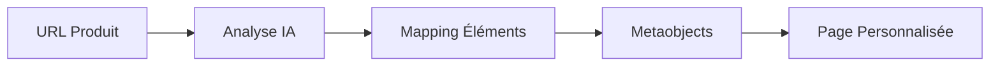
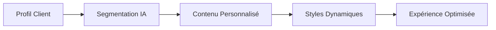
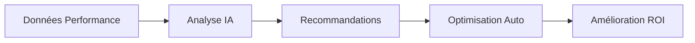

# 🔮 Vision Long Terme Adlign - Résumé Complet

## 🎯 Vue d'ensemble

Adlign évolue d'un simple outil de duplication de pages produits vers une **plateforme complète d'automatisation marketing** basée sur l'IA, avec une vision sur 5 phases de développement.

## 🚀 Phases de Développement

### **Phase 1 : Foundation ✅ (Actuelle)**
- ✅ **Mapping IA des thèmes** - Détection automatique des éléments modifiables
- ✅ **Création de metaobjects** - Stockage structuré du contenu personnalisé
- ✅ **Duplication de pages produits** - Pages multiples sans duplication SEO
- ✅ **API SaaS pour Lovable** - Intégration avec la plateforme frontend
- 🔄 **Template Adlign** - Template Liquid pour les pages dupliquées

### **Phase 2 : Personnalisation Avancée 🎨**
- 🎨 **Injection de styles personnalisés** - CSS/JS dynamique par campagne
- 📊 **Analytics et A/B testing** - Mesure d'impact automatique
- 🛒 **Expérience d'achat personnalisée** - Panier intelligent avec recommandations
- 👥 **Segmentation client automatique** - Tags et comportements clients

### **Phase 3 : Automatisation Marketing 🤖**
- 🎯 **Campagnes générées par IA** - Création automatique de campagnes
- 📈 **Optimisation continue** - Performance et conversion auto-optimisées
- 🤖 **Prédiction comportement client** - IA prédictive pour personnalisation
- 📊 **Insights prédictifs** - Recommandations automatiques

### **Phase 4 : Intelligence Artificielle Avancée 🧠**
- 🧠 **Optimisation automatique** - Campagnes auto-optimisées en temps réel
- 📱 **Extensions et widgets** - Personnalisation avancée du thème
- 🔗 **URLs et redirections intelligentes** - SEO dynamique et tracking
- 🎯 **Promotions automatiques** - Discounts contextuels et flash sales

### **Phase 5 : Écosystème Complet 🌐**
- 🌐 **Intégrations tierces** - Google Analytics, Facebook, TikTok, etc.
- 📈 **Reporting avancé** - Dashboards prédictifs et insights
- 🤖 **Chatbot personnalisé** - Support client IA intégré
- 📱 **Application mobile** - Gestion mobile des campagnes
- 🌍 **Support multi-langues** - Internationalisation complète

## 🔧 Scopes Shopify - Vision Complète

### **Scopes Actuels (Phase 1)**
```bash
read_products,write_products,read_metaobjects,write_metaobjects,read_themes,write_themes,write_metaobject_definitions
```

### **Scopes Complets (Phases 2-5)**
```bash
read_products,write_products,read_metaobjects,write_metaobjects,read_themes,write_themes,write_metaobject_definitions,read_theme_assets,write_theme_assets,read_analytics,read_reports,read_orders,write_orders,read_cart,write_cart,read_customers,write_customers,read_customer_tags,write_customer_tags,read_collections,write_collections,read_product_tags,write_product_tags,read_apps,write_apps,read_app_extensions,write_app_extensions,read_redirects,write_redirects,read_pages,write_pages,read_blog_posts,write_blog_posts,read_discounts,write_discounts,read_price_rules,write_price_rules,read_users,write_users,read_roles,write_roles
```

## 🎯 Cas d'Usage par Phase

### **Phase 1 : Foundation**
```javascript
// Duplication de page produit avec metaobjects
POST /api/saas/duplicate-product-page
{
  "shop_domain": "shop.myshopify.com",
  "product_id": "123456789",
  "landing_handle": "black-friday-2024",
  "mapping_id": "mapping_123"
}
```

### **Phase 2 : Personnalisation Avancée**
```javascript
// Injection de styles personnalisés
POST /api/saas/inject-custom-styles
{
  "shop_domain": "shop.myshopify.com",
  "campaign_id": "black-friday-2024",
  "custom_css": ".product-title { color: #ff0000; }"
}

// Analytics des performances
GET /api/saas/campaign-analytics/black-friday-2024
```

### **Phase 3 : Automatisation Marketing**
```javascript
// Campagne générée par IA
POST /api/saas/auto-campaign
{
  "campaign_type": "flash_sale",
  "target_audience": "high_value_customers",
  "budget": 1000
}

// Segmentation client automatique
POST /api/saas/segment-customer
{
  "customer_id": "123",
  "behavior_data": { "purchase_history": [...], "browsing_pattern": [...] }
}
```

### **Phase 4 : IA Avancée**
```javascript
// Optimisation automatique
POST /api/saas/auto-optimize
{
  "campaign_id": "black-friday-2024",
  "optimization_target": "conversion_rate",
  "budget_constraint": 500
}

// Promotions contextuelles
POST /api/saas/contextual-promotions
{
  "customer_segment": "cart_abandoners",
  "product_category": "electronics"
}
```

### **Phase 5 : Écosystème Complet**
```javascript
// Intégration multi-plateforme
POST /api/saas/multi-platform-sync
{
  "platforms": ["facebook", "google", "tiktok"],
  "campaign_data": { ... }
}

// Chatbot personnalisé
POST /api/saas/chatbot-response
{
  "customer_query": "Quand sera livré mon produit ?",
  "customer_context": { ... }
}
```

## 📊 Métriques de Succès

### **Phase 1 : Foundation**
- ✅ Temps de mapping : < 3 secondes
- ✅ Précision des sélecteurs : > 95%
- ✅ Compatibilité thèmes : 100%

### **Phase 2 : Personnalisation**
- 🎯 Amélioration conversion : +25%
- 🎯 Temps de création campagne : < 5 minutes
- 🎯 Couverture personnalisation : 90% des éléments

### **Phase 3 : Automatisation**
- 🤖 Réduction temps marketing : -70%
- 🤖 Amélioration ROI : +40%
- 🤖 Précision segmentation : > 90%

### **Phase 4 : IA Avancée**
- 🧠 Optimisation automatique : 100% des campagnes
- 🧠 Prédiction comportement : > 85% de précision
- 🧠 Réduction coûts acquisition : -30%

### **Phase 5 : Écosystème**
- 🌐 Intégrations tierces : 10+ plateformes
- 🌐 Couverture marché : 50+ pays
- 🌐 Satisfaction client : > 95%

## 🔄 Workflow Complet Long Terme

### **1. Détection Automatique**


### **2. Personnalisation Intelligente**


### **3. Optimisation Continue**


## 🚀 Prochaines Étapes Immédiates

### **1. Mise à jour des scopes Shopify**
```bash
# Exécuter le script de mise à jour
./update-scopes.sh

# Mettre à jour l'app dans Shopify Partner
# Réinstaller sur la boutique test
```

### **2. Test de la duplication avec nouveaux scopes**
```bash
# Tester l'endpoint de duplication
curl -X POST http://localhost:3000/api/saas/duplicate-product-page \
  -H "Content-Type: application/json" \
  -d '{"shop_domain": "adlign.myshopify.com", "product_id": "15096939610438", "landing_handle": "black-friday-2024", "mapping_id": "mapping_1754625541045_ubaly9sic"}'
```

### **3. Implémentation du Template Adlign**
- Créer le template Liquid pour les pages dupliquées
- Système de routage pour les URLs personnalisées
- Intégration avec les metaobjects

### **4. Développement des endpoints avancés**
- Analytics et reporting
- Gestion des clients et segmentation
- Automatisation des campagnes

## 📚 Documentation

- **Scopes détaillés** : `SHOPIFY_SCOPES_COMPLETE.md`
- **Duplication** : `DUPLICATION_METAOBJECTS.md`
- **Installation** : `INSTALLATION.md`
- **API SaaS** : `SAAS_API_DOCUMENTATION.md`

## 🎯 Objectif Final

**Adlign** deviendra la **première plateforme d'automatisation marketing** basée sur l'IA pour Shopify, permettant aux marchands de :

1. **Créer des campagnes personnalisées** en quelques clics
2. **Optimiser automatiquement** leurs performances
3. **Prédire le comportement client** pour maximiser les conversions
4. **Gérer un écosystème complet** d'outils marketing intégrés

**Vision** : Révolutionner le marketing e-commerce en rendant la personnalisation accessible à tous, de la startup à l'entreprise multinationale. 🚀
